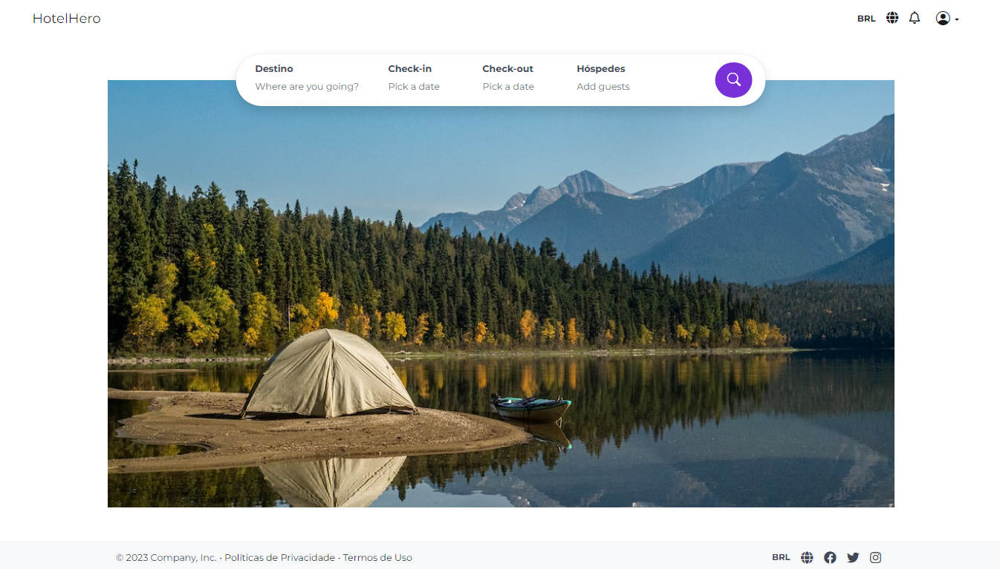
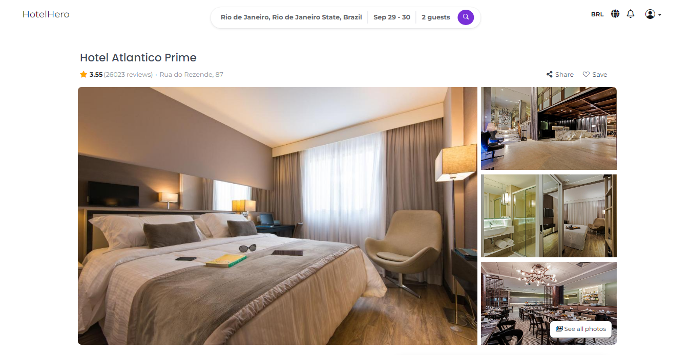
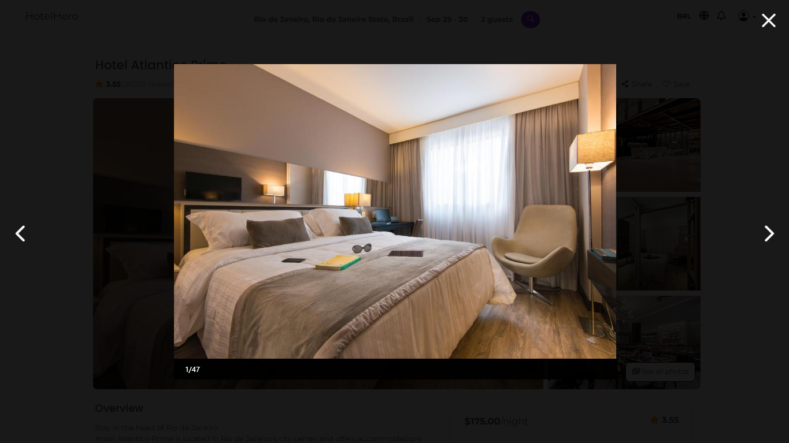
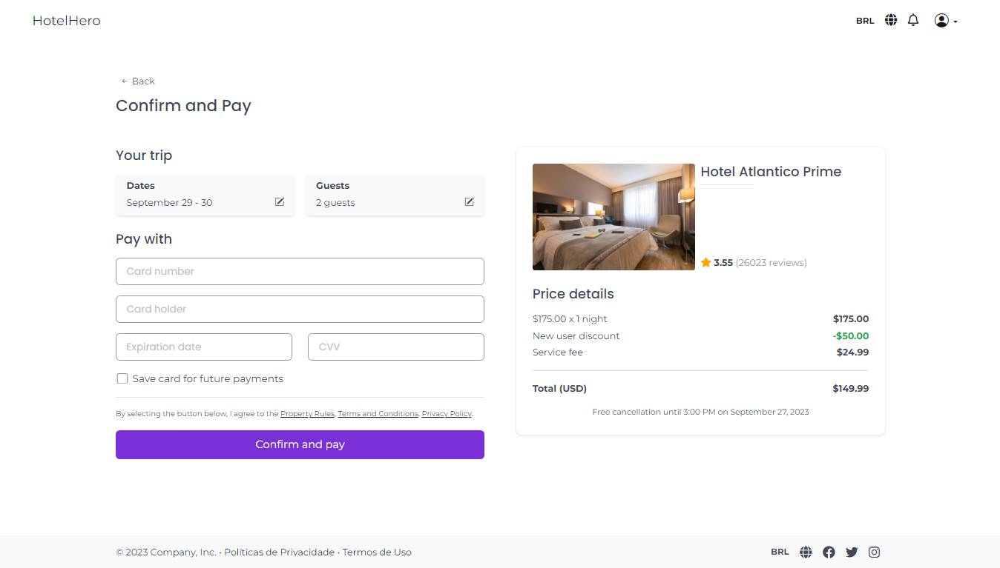

# HotelHero Client

O *HotelHero* é uma aplicação de reserva de hotéis projetada para oferecer uma experiência agradável desde a busca por hotéis até a realização da reserva. Desenvolvido com o objetivo de aprimorar e desafiar minhas habilidades de desenvolvimento, o projeto busca aliar requisitos reais com uma implementação prática e eficiente. Veja a aplicação ao vivo na Vercel clicando [aqui](https://hotelhero.vercel.app/).

## Principais Funcionalidades
- Login e Criação de conta
- Busca de hotéis com filtros
- Visualização detalhada do hotel
- Agendamento de reservas (fictício)

### Screenshots da Aplicação

  
  **Página de Cadastro**  

  
  **Página Home**  

  
  **Resultados da Pesquisa**  

  **Visualização Detalhada do Hotel**
  
  **Detalhes do Hotel (1)**  

  
  **Imagens do Hotel**  

  
  **Detalhes do Hotel (2)**  

  
  **Página de Pagamento**

<!-- ## Índice
- [Desafios & Aprendizados](#desafios-e-aprendizados)
- [Melhorias Futuras](#melhorias-futuras) -->

## Desafios & Aprendizados
- **Seleção de Framework:** Escolhi o Angular por sua estrutura e escalabilidade, valorizando sua organização em detrimento de outras opções como Vue.js e React.js.

- **Gerenciamento de Estado com NGXS:** Para manter estados consistentes, como o formulário de busca de hotéis e o estado de autenticação, optei pelo NGXS por sua simplicidade em relação ao NgRx.

- **Autenticação JWT:** Implementei a autenticação JWT via cookies, uma abordagem que equilibra segurança e experiência do usuário, sem a necessidade de atualizações frequentes de tokens.

- **Estratégia de Deploy:** Utilizei o GitHub Actions para acelerar o processo de deploy na Vercel, garantindo também a execução de testes unitários com Karma.

- **Integração Backend:** A necessidade de um backend personalizado surgiu devido às limitações das APIs públicas, permitindo uma integração mais eficaz e segura com o frontend.

- **Design do Banco de Dados:** Enfatizei um design minimalista, armazenando apenas dados essenciais e focando na estruturação eficaz das relações entre tabelas.

- **Habilidades de Design Frontend:** A implementação baseada em um template da [Visily](https://www.visily.ai/) reforçou minha confiança e habilidades em HTML e CSS.

- **Integração de API com Observables:** Optei por Observables usando Rxjs, uma abordagem reativa que agora me sinto mais confortável em usar.

- **Estrutura do Projeto e Autenticação:** Com o HotelHero, pude arquitetar um projeto desde o início, utilizando recursos robustos do Angular, como Route Guards e Interceptors, e aprofundando-me na autenticação JWT.

- **Gerenciamento de Estado:** A introdução ao NGXS transformou minha abordagem ao compartilhamento de dados, mostrando a eficácia das ferramentas de gerenciamento de estado.

- **DevOps e Deploy:** Aprendi sobre Docker, configuração de pipelines com GitHub Actions e solução de problemas de deploy, enriquecendo minha experiência em DevOps.

## Melhorias Futuras
- **Integrações de Pagamento:** Para oferecer uma experiência de reserva contínua, integrações com plataformas de pagamento de terceiros como Stripe, PayPal e Google Payments estão planejadas. Isso proporcionará aos usuários uma variedade de opções de pagamento, melhorando a experiência geral do usuário.

- **Cadastros Sociais:** Para simplificar o processo de cadastro e melhorar a acessibilidade do usuário, a integração com plataformas sociais como Facebook, Google e Apple para criação e login de contas está planejada.

- **Confirmação de Email:** Para garantir a autenticidade dos usuários e melhorar a segurança, uma etapa de confirmação de email será adicionada ao processo de cadastro.

- **Gerenciamento de Perfil do Usuário:** Uma página de perfil está em desenvolvimento, permitindo que os usuários atualizem e gerenciem suas informações pessoais, garantindo que seus detalhes estejam sempre atualizados.

- **Gerenciamento de Reservas:** Está planejada uma página abrangente de gerenciamento de reservas, onde os usuários podem visualizar suas reservas anteriores, gerenciar as pendentes e até mesmo cancelar ou reagendar conforme necessário.

- **Listagem de Propriedades:** Para proprietários e gerentes de hotéis, será introduzido um recurso para listar e gerenciar suas propriedades. Isso permitirá que eles disponibilizem seus hotéis para reserva, definam preços e gerenciem a disponibilidade.

- **Chat de Suporte:** Para melhorar o suporte ao cliente, será introduzido um recurso de chat, permitindo que os usuários se comuniquem diretamente com o suporte do hotel para dúvidas, problemas ou qualquer assistência que possam precisar.
